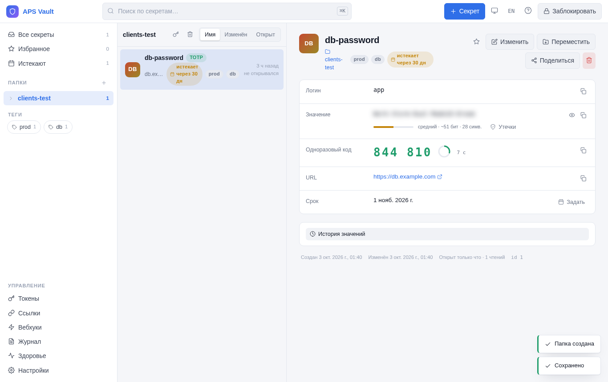
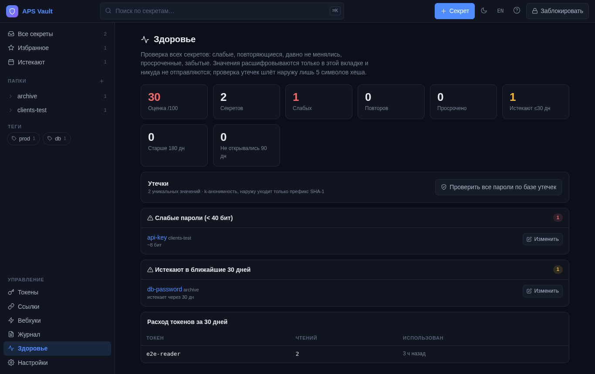

# APS Vault

A small, self-hosted secrets manager for one team: a web UI for humans, a machine API with
folder-scoped service tokens for services and AI agents, and nothing that phones home.

[Русская версия](README.ru.md) · [Architecture](docs/ARCHITECTURE.md) · [API](docs/API.md) ·
[Deployment](docs/DEPLOYMENT.md) · [Observability](docs/OBSERVABILITY.md) · [Access policies](docs/ACCESS-POLICIES.md) · [HashiCorp/Stronghold compatibility](docs/COMPATIBILITY.md) · [Security](SECURITY.md) · [Roadmap](ROADMAP.md) · [Changelog](CHANGELOG.md)

## Why another vault

HashiCorp Vault and friends are built for hundreds of engineers and a platform team to run
them. APS Vault is for the opposite case: a handful of people, dozens of services and agents,
one server. It is a few thousand lines of Python and vanilla JavaScript, stores everything in
one SQLite file (or one PostgreSQL database when you need replicas), and can be read end to
end in an evening.

- **Encryption that stays encrypted.** Argon2id derives a master key from a master password;
  every folder has its own random key wrapped by the master key; every value is AES-256-GCM
  with a fresh nonce. The database is useless without the master password or a token.
- **Folder-scoped service tokens.** A token unlocks exactly one folder and nothing else, and
  it works even while the vault is locked, because the token carries its own wrapped copy of
  the folder key. Read-only by default; `notes`, `totp` and `write` are opt-in per token.
- **Machine API first.** `GET /api/v1/m/secret/<name>` with a Bearer token is all a service
  needs. There is a CLI, a Python and a Node client, an MCP server for AI agents, and a browser
  extension.
- **Sealed delivery.** Bind a token to the application's X25519 public key and values leave
  the vault encrypted to it: nothing on the path reads them and a stolen token alone is
  useless. The clients decrypt in-process. See [docs/SEALED.md](docs/SEALED.md).
- **Hardware token for the master key.** Wrap the master key inside a PKCS#11 token (HSM or
  SoftHSM2; GOST mechanisms configurable for CryptoPro / Rutoken HSM) and unlock with its PIN;
  the wrap key never leaves the token. See [docs/HSM.md](docs/HSM.md).
- **GOST algorithms, if you need them.** `VAULT_CIPHER=gost` runs the whole vault on
  Kuznyechik-MGM, Streebog and KDF_TREE (GOST R 34.12/34.11-2012, RFC 9058), and a GOST R 34.10
  client key gets sealed delivery over VKO + Kuznyechik-MGM in all four clients — verified against
  the standards' test vectors; conformance by algorithm, not a certified module. See
  [docs/GOST.md](docs/GOST.md).
- **Cloud KMS for the master key.** AWS KMS or Yandex Cloud KMS as the wrapping key; with a
  PIN the KMS decrypts only with the PIN-derived encryption context, without one the cell
  serves SSO for a whole cluster. See [docs/KMS.md](docs/KMS.md).
- **Security keys and biometrics.** YubiKey, Touch ID, Windows Hello, Android via WebAuthn.
  With the PRF extension the master key is wrapped under the authenticator's secret and
  unlock is one touch; without it the key is a second factor.
- **People with roles.** Invite users by e-mail; each gets a role per folder — reader, writer
  or manager — and sees nothing else. Folder keys reach them sealed to their own key pair, so
  the database still holds no plaintext key and the owner never learns their password. The audit
  log names the person. See [docs/USERS.md](docs/USERS.md).
- **Read approval.** A flagged secret is read by a person only after a second person
  confirms from a link — no account, just an approver password; notified through any
  webhook. See [docs/APPROVALS.md](docs/APPROVALS.md).
- **Machine-only secrets.** Flag a secret and no person ever sees its value — not in the card,
  history, export or a share link; the server can generate and rotate it, only tokens read it.
- **Versions for key rotation.** Every value change is a numbered version; the machine API and
  the HashiCorp facade read `?version=N`, so a service can decrypt old files with the old key
  while new files already use the new one.
- **TOTP inside.** Store a 2FA seed next to a password and get the current code from the API.
- **Audit everything.** Every unlock, read, write, token use and share-link open is logged
  with IP and user agent.
- **Recoverable.** A one-time recovery code re-wraps the master key without re-encrypting
  data. Optional TOTP second factor on the master password. Optional OIDC login (Keycloak and
  any other OpenID Connect provider) on top.
- **A web UI built for the daily loop.** List + detail with deep links, ⌘K palette and
  keyboard navigation, dark/light/system theme, password generator (random or passphrase)
  with an honest entropy estimate, breach check against Have I Been Pwned without sending
  the password (k-anonymity), a health report (weak, reused, overdue, stale), rotation
  deadlines, live TOTP, drag-and-drop of credentials, one-time share links, value history,
  JSON export/import. Responsive down to a phone. [docs/COMPARISON.md](docs/COMPARISON.md)
  puts it next to Bitwarden, 1Password, Passbolt, HashiCorp and Infisical.
- **Where-and-when policies.** A token (or the whole UI) can be limited to source networks
  and time windows; a stolen token used elsewhere is refused and reported.
- **Observability.** Audit events to syslog/SIEM (JSON or CEF), Prometheus `/metrics`,
  a fail2ban-ready security log with filter and jail generator.
- **HashiCorp Vault / Deckhouse Stronghold compatible API** (`/v1/<folder>/data/<name>`,
  `LIST`, `lookup-self`, `X-Vault-Token`): `hvac` and the `vault` CLI work unchanged, so a team
  can start on APS Vault and move to Stronghold or HashiCorp later by changing the address —
  see [docs/COMPATIBILITY.md](docs/COMPATIBILITY.md).
- **English and Russian UI.**


<p>


</p>

## Quick start

```bash
git clone https://github.com/<you>/aps-vault.git && cd aps-vault
cp .env.example .env            # edit: public URL, allowed origins, init token
mkdir -p data && chown 10001:10001 data
docker compose up -d --build
open http://127.0.0.1:8087      # enter the init token, set a master password (≥12 chars), save the recovery code
```

Then create a folder, add a secret, issue a service token for that folder and read it back:

```bash
curl -s -H "Authorization: Bearer vlt_…" https://vault.example.com/api/v1/m/secret/db-password
# {"name":"db-password","value":"…","login":"app","updated_at":"2026-10-02T09:12:44"}
```

Put the backend behind a TLS-terminating reverse proxy; cookies are marked `Secure` and the
API refuses to be useful over plain HTTP from a browser. See [Deployment](docs/DEPLOYMENT.md).

## Clients

| Client | Where | Notes |
|---|---|---|
| Python | `clients/python/` | standard library only, 3.9+ (`cryptography` extra for sealed delivery) |
| Node | `clients/node/` | built-in `fetch` and `node:crypto`, Node 18+ |
| Go | `clients/go/` | standard library only, 1.20+ |
| Java | `clients/java/` | `java.net.http`, Java 11+, single file |
| CLI `vault get/put/list` | `ops/vault-cli.sh` | token from `VAULT_TOKEN`, `~/.vault-token` or `/etc/vault.conf` |
| MCP server | `mcp/` | stdio transport; gives an AI agent `health / list / get / put` within its token's folder |
| Browser extension | [aps-vault-extension](https://github.com/kzhebenev/aps-vault-extension) | Chrome/Firefox MV3: autofill, TOTP, search palette |

All clients: in-memory cache, retries with back-off, stale-cache fail-open so a vault restart
never takes your service down, token-shape check so a master password cannot be pasted by
mistake, sealed delivery (key pair generation and in-process decryption). See [examples/](examples/).

## Cluster

Several replicas behind a load balancer on one PostgreSQL behave as one vault: sessions,
lock-outs and the master-key verifier live in the database, the master key travels wrapped
inside the session (unwrapping key only in the client's cookie). `deploy/cluster/` is the
reference deployment, `docs/CLUSTER.md` explains it, `./run_tests.sh pg` proves it on
PostgreSQL 16 with two real nodes.

## What it is not

- Not a directory: one owner holds the master password and administers everything; named
  users (0.20) get roles per folder but do not manage folders, users or settings. Users sign in
  with a password; security keys and SSO for users are on the roadmap.
- Not a distributed database: a single node is one process and one SQLite file (`ops/backup.sh`);
  a cluster is identical replicas on one PostgreSQL that you operate and back up.
- Not a KMS: it stores secrets, it does not sign or encrypt your data for you. It can keep its
  own master key in a KMS or an HSM, and it can deliver secrets sealed to your application's key.

UI and API are in English and Russian (the UI follows the browser language; switch in the header).

## Status

Used in production by its authors since June 2026 for a few hundred secrets and a few dozen
service tokens. A code security review is in [docs/SECURITY-REVIEW-2026-10-02.md](docs/SECURITY-REVIEW-2026-10-02.md);
see [SECURITY.md](SECURITY.md) for the threat model and how to report issues.

## License

MIT — see [LICENSE](LICENSE).
