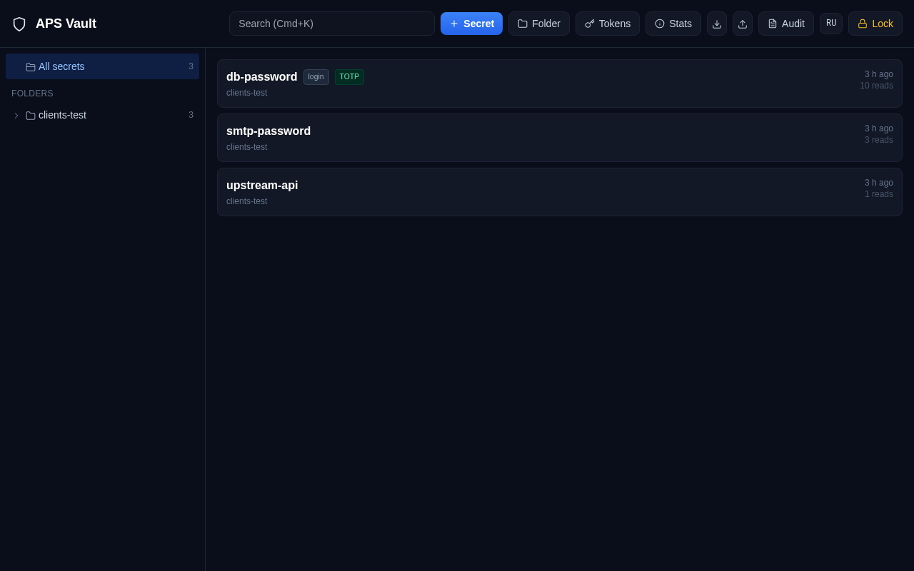

# APS Vault

A small, self-hosted secrets manager for one team: a web UI for humans, a machine API with
folder-scoped service tokens for services and AI agents, and nothing that phones home.

[Русская версия](README.ru.md) · [Architecture](docs/ARCHITECTURE.md) · [API](docs/API.md) ·
[Deployment](docs/DEPLOYMENT.md) · [Observability](docs/OBSERVABILITY.md) · [Access policies](docs/ACCESS-POLICIES.md) · [Security](SECURITY.md) · [Roadmap](ROADMAP.md) · [Changelog](CHANGELOG.md)

## Why another vault

HashiCorp Vault and friends are built for hundreds of engineers and a platform team to run
them. APS Vault is for the opposite case: a handful of people, dozens of services and agents,
one server. It is ~4 000 lines of Python and vanilla JavaScript, stores everything in a single
SQLite file, and can be read end to end in an evening.

- **Encryption that stays encrypted.** Argon2id derives a master key from a master password;
  every folder has its own random key wrapped by the master key; every value is AES-256-GCM
  with a fresh nonce. The database is useless without the master password or a token.
- **Folder-scoped service tokens.** A token unlocks exactly one folder and nothing else, and
  it works even while the vault is locked, because the token carries its own wrapped copy of
  the folder key. Read-only by default; `notes`, `totp` and `write` are opt-in per token.
- **Machine API first.** `GET /api/v1/m/secret/<name>` with a Bearer token is all a service
  needs. There is a CLI, a Python and a Node client, an MCP server for AI agents, and a browser
  extension.
- **TOTP inside.** Store a 2FA seed next to a password and get the current code from the API.
- **Audit everything.** Every unlock, read, write, token use and share-link open is logged
  with IP and user agent.
- **Recoverable.** A one-time recovery code re-wraps the master key without re-encrypting
  data. Optional TOTP second factor on the master password. Optional OIDC login (Keycloak and
  any other OpenID Connect provider) on top.
- **One-time share links**, secret history, JSON export/import, favorites, Cmd+K search.
- **Where-and-when policies.** A token (or the whole UI) can be limited to source networks
  and time windows; a stolen token used elsewhere is refused and reported.
- **Observability.** Audit events to syslog/SIEM (JSON or CEF), Prometheus `/metrics`,
  a fail2ban-ready security log with filter and jail generator.
- **HashiCorp KV v2 compatible reads** (`/v1/<folder>/data/<name>`, `X-Vault-Token`) — code
  written for HashiCorp Vault runs unchanged, and migrating to it later is a URL change.
- **English and Russian UI.**



## Quick start

```bash
git clone https://github.com/<you>/aps-vault.git && cd aps-vault
cp .env.example .env            # edit: public URL, allowed origins, init token
mkdir -p data && chown 10001:10001 data
docker compose up -d --build
open http://127.0.0.1:8087      # enter the init token, set a master password (≥12 chars), save the recovery code
```

Then create a folder, add a secret, issue a service token for that folder and read it back:

```bash
curl -s -H "Authorization: Bearer vlt_…" https://vault.example.com/api/v1/m/secret/db-password
# {"name":"db-password","value":"…","login":"app","updated_at":"2026-10-02T09:12:44"}
```

Put the backend behind a TLS-terminating reverse proxy; cookies are marked `Secure` and the
API refuses to be useful over plain HTTP from a browser. See [Deployment](docs/DEPLOYMENT.md).

## Clients

| Client | Where | Notes |
|---|---|---|
| Python | `clients/python/` | standard library only, 3.9+ |
| Node | `clients/node/` | built-in `fetch`, Node 18+ |
| Go | `clients/go/` | standard library only, 1.20+ |
| Java | `clients/java/` | `java.net.http`, Java 11+, single file |
| CLI `vault get/put/list` | `ops/vault-cli.sh` | token from `VAULT_TOKEN`, `~/.vault-token` or `/etc/vault.conf` |
| MCP server | `mcp/` | stdio transport; gives an AI agent `health / list / get / put` within its token's folder |
| Browser extension | [aps-vault-extension](https://github.com/kzhebenev/aps-vault-extension) | Chrome/Firefox MV3: autofill, TOTP, search palette |

All clients: in-memory cache, retries with back-off, stale-cache fail-open so a vault restart
never takes your service down, token-shape check so a master password cannot be pasted by
mistake. See [examples/](examples/).

## What it is not

- Not multi-user: one master password per instance, no roles in the UI. Isolation is between
  *services* (via tokens), not between *people*.
- Not distributed: one process, one SQLite file, one uvicorn worker. Back up the `data/`
  directory (see `ops/backup.sh`).
- Not a KMS: it stores secrets, it does not sign or encrypt your data for you.

UI and API are in English and Russian (the UI follows the browser language; switch in the header).

## Status

Used in production by its authors since June 2026 for a few hundred secrets and a few dozen
service tokens. A code security review is in [docs/SECURITY-REVIEW-2026-10-02.md](docs/SECURITY-REVIEW-2026-10-02.md);
see [SECURITY.md](SECURITY.md) for the threat model and how to report issues.

## License

MIT — see [LICENSE](LICENSE).
